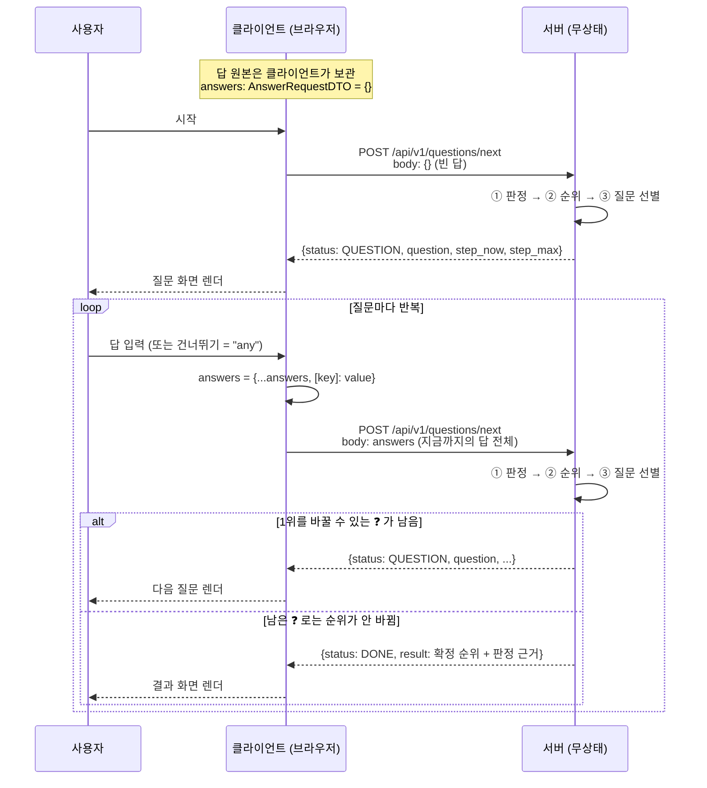
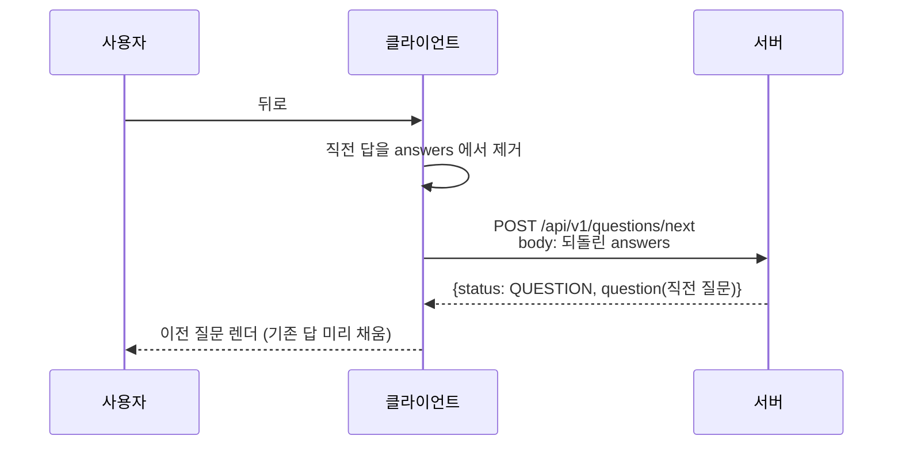

# 질문 API 계약 — 무엇을 주고받나

서버와 클라이언트가 주고받는 형식을 정한다. 왕복 하나의 모양 → 전체 흐름 → 실제 예시 → 타입 순서로 읽는다.

서버가 그 왕복 안에서 무엇을 계산하는지는 [순위 엔진](ranking-engine.md)이, 응답에 실리는 적금 데이터의 모양은 [적금 데이터](savings-data.md)가 다룬다.

## 전제 — 서버는 기억하지 않는다

- 서버는 **무상태(stateless)** 다. 사용자 답변을 저장하지 않고, 매 요청에 실려 온 답 전체로 그때그때 계산한다.
- 답의 원본은 브라우저 sessionStorage(`common/services/recommendationService`)에 있다. 세션 id·쿠키·회원 개념은 없다.

## 한 번의 왕복 — 대화의 기본 단위

클라이언트와 서버의 대화는 이 왕복 하나가 전부다. 이것이 끝날 때까지 반복된다.

```
클라이언트 → 서버   POST /api/v1/questions/next
                   body: 지금까지의 답 전체  {"monthly": "300000", "months": "12", ...}

서버 → 클라이언트   다음 질문                {"status": "question", "question": {...}}
                   또는 최종 결과            {"status": "done", "result": {...}}
```

요청 본문은 `{질문key: 답변}` 쌍이 쌓이는 JSON 객체 하나다. 답할 때마다 쌍이 하나씩 늘어나고,
같은 질문에 다시 답하면 그 쌍만 덮어써진다 (질문당 답 하나가 구조로 보장된다).

답 쌍의 의미: 키 없음 = 아직 안 물음 · `"any"` = 건너뜀(모름) · 그 밖의 문자열 = 답.
값은 항상 문자열이다 — `null` 을 쓰지 않는다.

## 전체 흐름 — 시퀀스 다이어그램



다이어그램의 ①②③ 이 서버의 일 전부다 — 그 세 단계는 [순위 엔진](ranking-engine.md)에 있다.

## 예시 — 한 사용자의 처음부터 끝까지

위 왕복이 실제로 쌓이는 모습이다. 요청마다 본문에 쌍이 하나씩 늘고, 응답은 다음 질문 또는 최종 결과다.

**1번째 왕복** — 빈 답으로 시작:

```json
요청: {}

응답: {
    "status": "question",
    "step_now": 1,
    "step_max": 3,
    "question": {
        "key": "monthly",
        "title": "매달 얼마씩 넣을까요?",
        "inputKind": "number",
        "hintExample": "예: 30만원",
        "options": [["100000", "10만원"], ["300000", "30만원"], ["500000", "50만원"], ["1000000", "100만원"]]
    }
}
```

**2번째 왕복** — 첫 답이 쌓임:

```json
요청: {"monthly": "300000"}

응답: {
    "status": "question",
    "step_now": 2,
    "step_max": 3,
    "question": {
        "key": "months",
        "title": "얼마 동안 넣을까요?",
        "inputKind": "options",
        "options": [["6", "6개월"], ["12", "1년"], ["24", "2년"], ["36", "3년"], ["any", "정하지 않았어요"]]
    }
}
```

**3번째 왕복** — 쌍 추가. 이 답부터 서버는 순위를 매길 수 있고, 1위를 바꿀 수 있는 ❓(급여 이체 은행)를 골라 묻는다:

```json
요청: {"monthly": "300000", "months": "12"}

응답: {
    "status": "question",
    "step_now": 1,
    "step_max": 1,
    "question": {
        "key": "salaryBank",
        "title": "급여나 연금은 어느 은행으로 받으세요?",
        "inputKind": "options",
        "options": [["우리은행", "우리은행"], ["신한은행", "신한은행"], ["", "없어요"]]
    }
}
```

**4번째 왕복** — 건너뛴 답은 `"any"` 로 쌓인다 (`goal` 을 건너뛴 경우):

```json
요청: {"monthly": "300000", "months": "12", "goal": "any", "salaryBank": "우리은행"}
```

**마지막 왕복** — 우대조건 즉석 질문(`q:` 접두사 키)까지 답했고, 남은 ❓ 중 1위를 바꿀 것이 없다.
서버는 확정 순위와 판정 근거를 담아 끝낸다:

```json
요청: {
    "monthly": "300000",
    "months": "12",
    "goal": "any",
    "salaryBank": "우리은행",
    "banks": "카카오뱅크",
    "cardBank": "신한은행",
    "cardAmt": "100000-499999",
    "autopay": "yes",
    "q:가입 후 그 은행 오픈뱅킹에 다른 은행 계좌를 등록해도 괜찮아요?": "yes"
}

응답: {
    "status": "done",
    "result": {
        "rows": [
            {
                "product_id": "p01",
                "rank": 1,
                "rate": 3.45,
                "expected_total": 3667350,
                "verdicts": [
                    {"type": "salary", "verdict": "✅", "reason": "급여/연금 이체 +0.7%p"},
                    {"type": "autopay", "verdict": "✅", "reason": "공과금 자동이체 +0.3%p"},
                    {"type": "card", "verdict": "❌", "reason": "우리카드 월 10만원 이상 필요"}
                ]
            },
            {"product_id": "p13", "rank": 2, "rate": 3.30, "expected_total": 3664290, "verdicts": []}
        ]
    }
}
```

### 뒤로 가기

서버는 기억이 없으므로 "이전 질문"도 클라이언트가 답을 되돌린 뒤 다시 요청해서 얻는다.



## 답의 수명 — 언제 생기고 언제 비워지나

위 왕복 내내 답의 원본은 sessionStorage 의 비교 세션(`recommendationService` 의 `entries`) 한 곳이다.
읽기·쓰기·리셋이 모두 이 서비스를 지나므로, 찾아보기를 몇 번 반복해도 선택 사항의 출처는 갈라지지 않는다.

```
질문 시작 (시작 화면에서)   entries = []          ← 새 찾아보기, 깨끗하게 리셋
질문에 답할 때마다          entries 에 쌍 추가
뒤로 가기                  마지막 쌍 제거 후 재요청
시작 화면으로 돌아가기만      유지                  ← 리셋 아님
```

리셋 시점은 "시작 화면 진입"이 아니라 **"질문을 다시 시작"** 이다 (`useStart.start` 와 브랜드 로고의 `resetRecommendation()`).
화면 진입만으로 지우면 실수로 뒤로 갔다가 답을 전부 잃는다 — 리셋은 사용자가 "처음부터 다시"를 명시적으로 선택했을 때만 한다.

새로고침(F5)에는 답이 살아남는다. 탭을 닫으면 sessionStorage 와 함께 사라진다.

## 데이터 계약 — 주고받는 모양의 타입

위 예시의 요청·응답이 코드에서 갖는 타입이다.

| 방향 | 타입 (프론트 `src/common/types/recommendation.ts`) | 서버 대응 |
|---|---|---|
| 클라이언트 → 서버 | `AnswerRequestDTO` — 질문 key → 답 문자열 | `app/dto/request/answer.py` — 동적 키를 받는 RootModel |
| 서버 → 클라이언트 | `NextStepResponseDTO` — `QUESTION`(다음 질문) 또는 `DONE`(최종 순위 포함) | `app/dto/response/next_step.py` — `status` 로 갈라지는 두 형태 |

- 예시의 `question` 모양은 프론트 `QuestionResponseDTO` 와 같다.
- `result.rows` 의 필드 구성은 프론트 `RankedProductResponseDTO` 와 1:1 이다.
- 답을 배열(`[{key, value}, ...]`)로 보내지 않는다 — 같은 키의 중복이 가능해져 "최신 답" 선별 규칙이 양쪽에 생기고,
  키 조회마다 배열을 뒤져야 한다. 답한 순서는 답의 의미가 아니므로 보존하지 않는다 (질문 순서의 주인은 서버다).
- 질문 키는 우대조건에서 즉석으로 생기므로(`q:` 접두사) 고정 필드로 선언할 수 없다 — 이 한 경계에서만 동적 키 dict 를 쓰고,
  값은 양쪽 모두 문자열로 고정한다.

## 설계 근거

- **답 전체를 매번 보낸다** — 서버가 저장하지 않기로 했으므로 상태는 클라이언트에만 있다.
  본문 크기는 질문 수십 개 × 짧은 문자열이라 1~2KB 수준으로 비용이 무시할 만하다.
- **세션 id 없음** — 식별할 것이 없으니 발급·리셋 문제 자체가 없다. 새로고침 유지가 필요하면 클라이언트가 sessionStorage 로 해결한다.
  서버가 사용자를 구별하지 않아도 되는 이유는 [순위 엔진](ranking-engine.md)에 있다.
- **답변은 본문에 실어도 된다** — 답은 클라이언트가 주인인 데이터라 신뢰 문제가 없다.
  (믿으면 안 되는 것은 신원 주장이지 자기 입력이 아니다.)
- **응답은 discriminated union** — `status` 로 갈라지는 두 갈래(`QUESTION`/`DONE`)라, 한쪽을 확인하면 그 안의 필드가 타입으로 확정된다.
  `question`·`result` 중 쓰지 않는 쪽이 `null` 인 것을 호출부가 다시 검사할 필요가 없다.
- **DONE 이 결과를 싣는다** — 순위의 재료(판정·계산)가 전부 서버에 있으므로, "끝났음"만 알리고 결과를 다른 API 로 다시 받는 왕복을 만들지 않는다.
